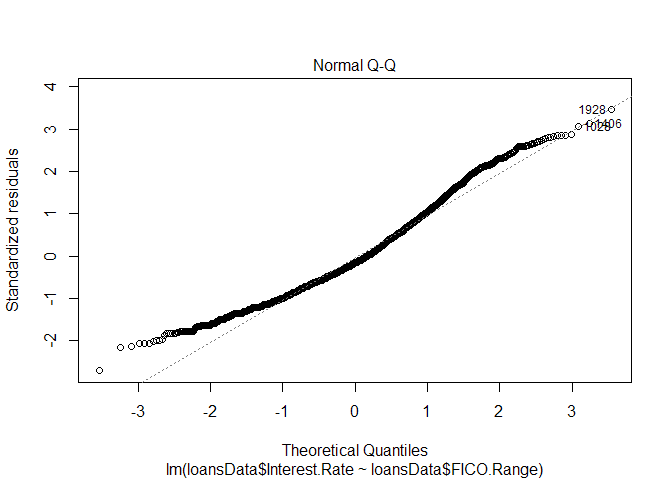
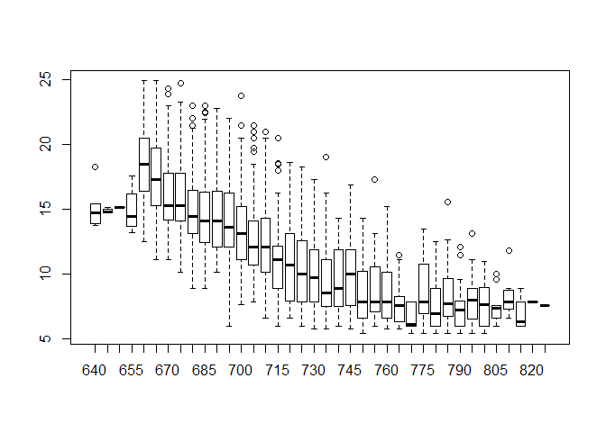

# Untitled
ap  
31 October 2015  


```r
# load the data set

loansData <- read.csv("loansData.csv", header=T, as.is = TRUE)

summary(loansData)
```

```
##  Amount.Requested Amount.Funded.By.Investors Interest.Rate     
##  Min.   : 1000    Min.   :   -0.01           Length:2500       
##  1st Qu.: 6000    1st Qu.: 6000.00           Class :character  
##  Median :10000    Median :10000.00           Mode  :character  
##  Mean   :12406    Mean   :12001.57                             
##  3rd Qu.:17000    3rd Qu.:16000.00                             
##  Max.   :35000    Max.   :35000.00                             
##                                                                
##  Loan.Length        Loan.Purpose       Debt.To.Income.Ratio
##  Length:2500        Length:2500        Length:2500         
##  Class :character   Class :character   Class :character    
##  Mode  :character   Mode  :character   Mode  :character    
##                                                            
##                                                            
##                                                            
##                                                            
##     State           Home.Ownership     Monthly.Income    
##  Length:2500        Length:2500        Min.   :   588.5  
##  Class :character   Class :character   1st Qu.:  3500.0  
##  Mode  :character   Mode  :character   Median :  5000.0  
##                                        Mean   :  5688.9  
##                                        3rd Qu.:  6800.0  
##                                        Max.   :102750.0  
##                                        NA's   :1         
##   FICO.Range        Open.CREDIT.Lines Revolving.CREDIT.Balance
##  Length:2500        Min.   : 2.00     Min.   :     0          
##  Class :character   1st Qu.: 7.00     1st Qu.:  5586          
##  Mode  :character   Median : 9.00     Median : 10962          
##                     Mean   :10.08     Mean   : 15245          
##                     3rd Qu.:13.00     3rd Qu.: 18889          
##                     Max.   :38.00     Max.   :270800          
##                     NA's   :2         NA's   :2               
##  Inquiries.in.the.Last.6.Months Employment.Length 
##  Min.   :0.0000                 Length:2500       
##  1st Qu.:0.0000                 Class :character  
##  Median :0.0000                 Mode  :character  
##  Mean   :0.9063                                   
##  3rd Qu.:1.0000                                   
##  Max.   :9.0000                                   
##  NA's   :2
```

```r
str(loansData)
```

```
## 'data.frame':	2500 obs. of  14 variables:
##  $ Amount.Requested              : int  20000 19200 35000 10000 12000 6000 10000 33500 14675 7000 ...
##  $ Amount.Funded.By.Investors    : num  20000 19200 35000 9975 12000 ...
##  $ Interest.Rate                 : chr  "8.90%" "12.12%" "21.98%" "9.99%" ...
##  $ Loan.Length                   : chr  "36 months" "36 months" "60 months" "36 months" ...
##  $ Loan.Purpose                  : chr  "debt_consolidation" "debt_consolidation" "debt_consolidation" "debt_consolidation" ...
##  $ Debt.To.Income.Ratio          : chr  "14.90%" "28.36%" "23.81%" "14.30%" ...
##  $ State                         : chr  "SC" "TX" "CA" "KS" ...
##  $ Home.Ownership                : chr  "MORTGAGE" "MORTGAGE" "MORTGAGE" "MORTGAGE" ...
##  $ Monthly.Income                : num  6542 4583 11500 3833 3195 ...
##  $ FICO.Range                    : chr  "735-739" "715-719" "690-694" "695-699" ...
##  $ Open.CREDIT.Lines             : int  14 12 14 10 11 17 10 12 9 8 ...
##  $ Revolving.CREDIT.Balance      : int  14272 11140 21977 9346 14469 10391 15957 27874 7246 7612 ...
##  $ Inquiries.in.the.Last.6.Months: int  2 1 1 0 0 2 0 0 1 0 ...
##  $ Employment.Length             : chr  "< 1 year" "2 years" "2 years" "5 years" ...
```

```r
sapply(loansData[1,], class)
```

```
##               Amount.Requested     Amount.Funded.By.Investors 
##                      "integer"                      "numeric" 
##                  Interest.Rate                    Loan.Length 
##                    "character"                    "character" 
##                   Loan.Purpose           Debt.To.Income.Ratio 
##                    "character"                    "character" 
##                          State                 Home.Ownership 
##                    "character"                    "character" 
##                 Monthly.Income                     FICO.Range 
##                      "numeric"                    "character" 
##              Open.CREDIT.Lines       Revolving.CREDIT.Balance 
##                      "integer"                      "integer" 
## Inquiries.in.the.Last.6.Months              Employment.Length 
##                      "integer"                    "character"
```

```r
# Basic Exploratory Analysis. 

length(unique(loansData$FICO.Range))
```

```
## [1] 38
```

```r
table(loansData$Loan.Length)
```

```
## 
## 36 months 60 months 
##      1952       548
```

```r
table(loansData$Loan.Purpose)
```

```
## 
##                car        credit_card debt_consolidation 
##                 50                444               1307 
##        educational   home_improvement              house 
##                 15                152                 20 
##     major_purchase            medical             moving 
##                101                 30                 29 
##              other   renewable_energy     small_business 
##                201                  4                 87 
##           vacation            wedding 
##                 21                 39
```

```r
quantile(loansData$Open.CREDIT.Line, na.rm=T)
```

```
##   0%  25%  50%  75% 100% 
##    2    7    9   13   38
```

```r
#table of correlations 

numeric.columns <- names(loansData)[unlist(lapply(loansData,"class")) %in% c("numeric", "integer")]
dn <- as.matrix(loansData[,numeric.columns])
cordn <- cor( dn[complete.cases(dn),] ) 


# convert interest rates to numeric type

loansData$Interest.Rate <- as.numeric(gsub("%$", "", loansData$Interest.Rate))

# get the lower part of the FICO range

loansData$FICO.Range <- as.numeric(as.character(gsub("-...", "", loansData$FICO.Range)))

loansData$Debt.To.Income <- as.numeric(gsub("%$", "", loansData$Debt.To.Income.Ratio))

which(is.na(loansData))
```

```
## [1] 20367 25367 26595 27867 29095 30367 31595
```

```r
# only keep complete cases. 

loansData <- loansData[complete.cases(loansData), ]


# Interest rate vs Loan Length interaction. 

loansData$Loan.Length <- as.numeric(lapply(strsplit(loansData$Loan.Length, split = " "), "[", 1))

plot(loansData$Interest.Rate~loansData$Loan.Length)
```

 

```r
cor.test(loansData$Interest.Rate, loansData$Loan.Length)
```

```
## 
## 	Pearson's product-moment correlation
## 
## data:  loansData$Interest.Rate and loansData$Loan.Length
## t = 23.3563, df = 2496, p-value < 2.2e-16
## alternative hypothesis: true correlation is not equal to 0
## 95 percent confidence interval:
##  0.3907779 0.4551643
## sample estimates:
##       cor 
## 0.4235058
```

```r
tapply(loansData$Interest.Rate, loansData$Loan.Length,mean)
```

```
##       36       60 
## 12.13256 16.40746
```

```r
tapply(loansData$Interest.Rate, loansData$Loan.Length,sd)
```

```
##       36       60 
## 3.684019 4.127213
```

```r
sd(loansData$Interest.Rate)
```

```
## [1] 4.178007
```

```r
mean(loansData$FICO.Range)
```

```
## [1] 705.8587
```

```r
summary(lm(loansData$Interest.Rate~loansData$Loan.Length))
```

```
## 
## Call:
## lm(formula = loansData$Interest.Rate ~ loansData$Loan.Length)
## 
## Residuals:
##      Min       1Q   Median       3Q      Max 
## -10.6175  -3.2326  -0.0126   2.5174  12.7574 
## 
## Coefficients:
##                       Estimate Std. Error t value Pr(>|t|)    
## (Intercept)           5.720202   0.323684   17.67   <2e-16 ***
## loansData$Loan.Length 0.178121   0.007626   23.36   <2e-16 ***
## ---
## Signif. codes:  0 '***' 0.001 '**' 0.01 '*' 0.05 '.' 0.1 ' ' 1
## 
## Residual standard error: 3.786 on 2496 degrees of freedom
## Multiple R-squared:  0.1794,	Adjusted R-squared:  0.179 
## F-statistic: 545.5 on 1 and 2496 DF,  p-value: < 2.2e-16
```

```r
# Regression Line  ----

loansData$Loan.Length <- as.factor(loansData$Loan.Length)                          
    

bestline= lm(loansData$Interest.Rate ~ loansData$FICO.Range + loansData$Monthly.Income + loansData$Amount.Requested +loansData$Loan.Length )  

summary(bestline)
```

```
## 
## Call:
## lm(formula = loansData$Interest.Rate ~ loansData$FICO.Range + 
##     loansData$Monthly.Income + loansData$Amount.Requested + loansData$Loan.Length)
## 
## Residuals:
##    Min     1Q Median     3Q    Max 
## -9.683 -1.451 -0.130  1.277 10.262 
## 
## Coefficients:
##                              Estimate Std. Error t value Pr(>|t|)    
## (Intercept)                 7.245e+01  8.534e-01  84.904   <2e-16 ***
## loansData$FICO.Range       -8.746e-02  1.216e-03 -71.934   <2e-16 ***
## loansData$Monthly.Income   -2.844e-05  1.170e-05  -2.432   0.0151 *  
## loansData$Amount.Requested  1.446e-04  6.472e-06  22.349   <2e-16 ***
## loansData$Loan.Length60     3.265e+00  1.125e-01  29.024   <2e-16 ***
## ---
## Signif. codes:  0 '***' 0.001 '**' 0.01 '*' 0.05 '.' 0.1 ' ' 1
## 
## Residual standard error: 2.108 on 2493 degrees of freedom
## Multiple R-squared:  0.7458,	Adjusted R-squared:  0.7454 
## F-statistic:  1828 on 4 and 2493 DF,  p-value: < 2.2e-16
```

```r
confint(bestline) 
```

```
##                                    2.5 %        97.5 %
## (Intercept)                 7.078064e+01  7.412737e+01
## loansData$FICO.Range       -8.984321e-02 -8.507495e-02
## loansData$Monthly.Income   -5.137086e-05 -5.506809e-06
## loansData$Amount.Requested  1.319564e-04  1.573394e-04
## loansData$Loan.Length60     3.044474e+00  3.485665e+00
```

```r
# PLOTS Misc ----

# par(mfrow = c(1, 2))
plot(loansData$FICO.Range, loansData$Interest.Rate, col=as.factor(loansData$Loan.Length),
     xlab="FICO Score", 
     ylab="Interest Rate (%)", 
     main="Interest vs FICO Score by Loan Length" )

abline(73.05044, -0.08467, col="orange")

legend(750, 20, legend=c("34 m", "60 m"), 
       col=c("black","red"), 
       pch=c(15,15), 
       cex=c(0.4, 0.4))
```

```
## Warning in if (xc < 0) text.width <- -text.width: the condition has length
## > 1 and only the first element will be used
```

 

```r
plot(loansData$Interest.Rate ~ as.factor(loansData$Loan.Length), 
     col = "blue", varwidth = TRUE, 
     ylab="Interest Rate (%)", xlab="Loan Length (months)",
     main="Interest Rate distribution by Loan Length")
```

 

```r
#install.packages("hmisc"); library(Hmisc)

#cut<-cut2(loansData$Amount.Requested,g=3)
plot(loansData$FICO.Range, loansData$Interest.Rate, col=cut)
```

```
## Warning in plot.xy(xy, type, ...): supplied color is neither numeric nor
## character
```

 

```r
plot(lm(loansData$Interest.Rate ~ loansData$FICO.Range))  
```

    

```r
plot(loansData$FICO.Range,loansData$Interest.Rate)
```

 

```r
hist(loansData$FICO.Range, freq=T)
```

 

```r
# Boxplots

plot(loansData$Interest.Rate ~ as.factor(loansData$Loan.Length))
```

 

```r
boxplot(loansData$Interest.Rate ~ as.factor(loansData$FICO.Range))  
```

 

```r
boxplot(loansData$Interest.Rate ~ loansData$Home.Ownership)
```

 

```r
boxplot(loansData$Interest.Rate ~ loansData$Loan.Purpose)
```

 

```r
boxplot(loansData$Interest.Rate ~ loansData$Home.Ownership, notch=TRUE)
```

```
## Warning in bxp(structure(list(stats = structure(c(5.42, 9.63, 12.42,
## 15.58, : some notches went outside hinges ('box'): maybe set notch=FALSE
```

 

```r
boxplot(loansData$Interest.Rate ~ loansData$Loan.Purpose, notch=TRUE)
```

```
## Warning in bxp(structure(list(stats = structure(c(5.79, 7.62, 10.475,
## 13.93, : some notches went outside hinges ('box'): maybe set notch=FALSE
```

 

```r
# Pairwise plot. 
pairs(cbind(loansData$Amount.Requested, loansData$Interest.Rate, loansData$Monthly.Income, loansData$FICO.Range), gap = 0, panel = panel.smooth)
```

 


